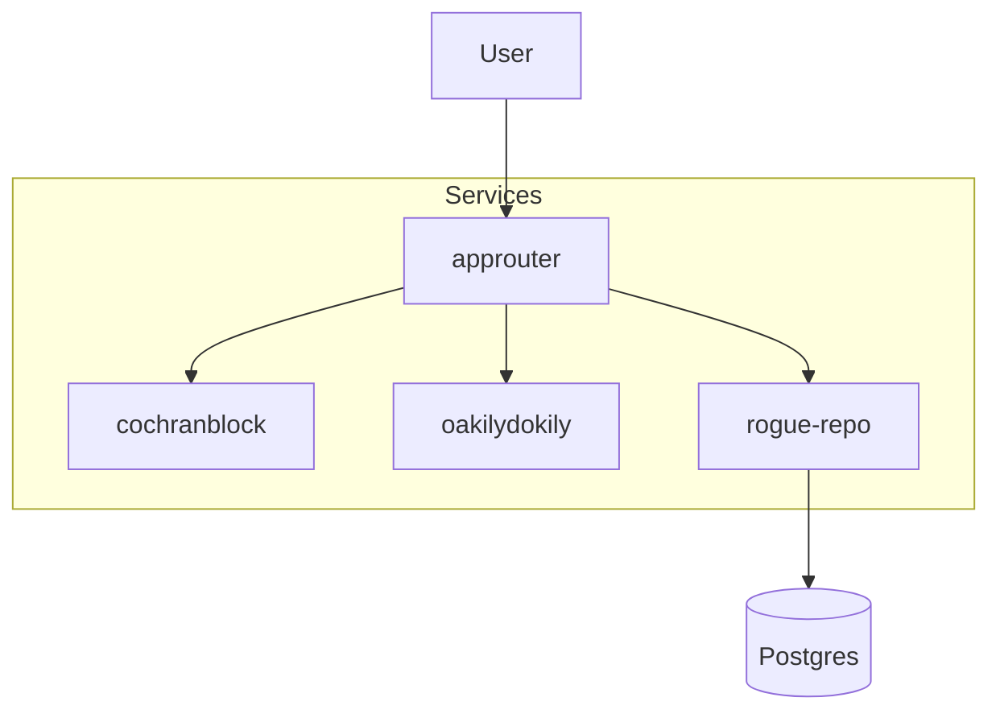

# cochranblock

## Proof of Artifacts

*Wire diagrams, screenshots, and demos for quick review.*



See each project README for more: [cochranblock](cochranblock/README.md), [oakilydokily](oakilydokily/README.md), [rogue-repo](rogue-repo/README.md), [kova](kova/README.md). Convention: [docs/PROOF_OF_ARTIFACTS.md](docs/PROOF_OF_ARTIFACTS.md).

---

Monorepo: approuter, cochranblock, oakilydokily, rogue-repo, kova, and related projects. Railway deployment.

## Build from workspace

```bash
./scripts/build-monorepo.sh /path/to/workspace/root
```

## Railway setup

1. Create project at [railway.com](https://railway.com)
2. Add 4 services + Postgres
3. Connect this repo (cochranblock/cochranblock)
4. Set Root Directory per service: approuter, cochranblock, oakilydokily, rogue-repo
5. Add env vars per [approuter/docs/RAILWAY.md](approuter/docs/RAILWAY.md)

## GitHub

Push to cochranblock/cochranblock (create repo first if needed).
