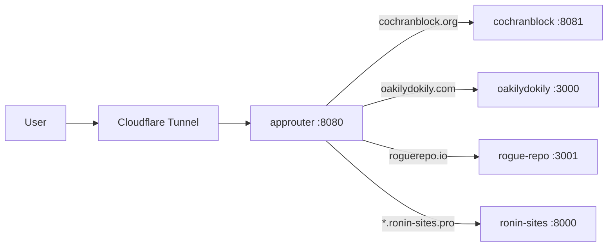

<!-- Unlicense — cochranblock.org -->
<!-- Contributors: Mattbusel (XFactor), GotEmCoach, KOVA, Claude Opus 4.6, SuperNinja, Composer 1.5, Google Gemini Pro 3 -->

> **It's not the Mech — it's the pilot.**
>
> This repo is part of [CochranBlock](https://cochranblock.org) — 8 Unlicense Rust repositories that power an entire company on a **single <10MB binary**, a laptop, and a **$10/month** Cloudflare tunnel. No AWS. No Kubernetes. No six-figure DevOps team. Zero cloud.
>
> **[cochranblock.org](https://cochranblock.org)** is a live demo of this architecture. You're welcome to read every line of source code — it's all public domain.
>
> Every repo ships with **[Proof of Artifacts](PROOF_OF_ARTIFACTS.md)** (wire diagrams, screenshots, and build output proving the work is real) and a **[Timeline of Invention](TIMELINE_OF_INVENTION.md)** (dated commit-level record of what was built, when, and why — proving human-piloted AI development, not generated spaghetti).
>
> **Looking to cut your server bill by 90%?** → [Zero-Cloud Tech Intake Form](https://cochranblock.org/deploy)

---

<p align="center">
  
</p>

# approuter

Index and router for cochranblock products.

## Proof of Artifacts

*Wire diagrams for quick review.*

### Wire / Architecture



---

**This repo contains approuter only.** Product source lives in separate repos.

## Products (separate repos)

| Product | Repo | Description |
|---------|------|-------------|
| **cochranblock** | [cochranblock/cochranblock](https://github.com/cochranblock/cochranblock) | cochranblock.org site |
| **oakilydokily** | [cochranblock/oakilydokily](https://github.com/cochranblock/oakilydokily) | Hero site with mural |
| **rogue-repo** | [cochranblock/rogue-repo](https://github.com/cochranblock/rogue-repo) | Software repo + ISO 8583 |
| **kova** | [cochranblock/kova](https://github.com/cochranblock/kova) | Augment engine |
| **whyyoulying** | [cochranblock/whyyoulying](https://github.com/cochranblock/whyyoulying) | Labor fraud detection |
| **wowasticker** | [cochranblock/wowasticker](https://github.com/cochranblock/wowasticker) | Student goals app |

## This repo

- **approuter** — Reverse proxy + app registration for Cloudflare tunnel. Routes traffic to the products above.

## Modules

| Module | LOC | Purpose |
|--------|-----|---------|
| main.rs | 359 | CLI (clap), axum server, route wiring, health + analytics handlers |
| cloudflare.rs | 978 | Full Cloudflare API: zones, CNAME, tunnel sync, ingress rules, rate limits, cache rules |
| tunnel_provider.rs | 459 | Multi-tunnel abstraction: Cloudflare, ngrok, Tailscale Funnel, Bore, localtunnel |
| run.rs | 406 | `start-all` command: spawns approuter + all backends + cloudflared |
| api.rs | 338 | REST API: register, unregister, list apps, DNS update, tunnel control, dashboard |
| analytics.rs | 292 | Server-side visitor analytics from Cloudflare geo headers (zero JS, zero cookies) |
| restart.rs | 236 | Per-service restart subcommands (pkill + cargo build + exec) |
| tunnel_metrics.rs | 230 | Per-provider latency, uptime, error tracking with percentile stats |
| registry.rs | 226 | App registry: hostname → backend_url, file-persisted, thread-safe RwLock, wildcard matching |
| proxy.rs | 184 | Reverse proxy: host-based, path-based, suffix matching, 30s timeout |
| tunnel.rs | 156 | Cloudflare tunnel: config generation, cloudflared spawn, binary download + SHA256 verify |
| tunnel_api.rs | 111 | Multi-tunnel API: status, start/stop, health, metrics, competition dashboard |
| setup.rs | 96 | Setup subcommands: purge-cache, cache rules, rate limit, DNS, Google SA |
| client/src/lib.rs | 75 | approuter-client crate: retry-based self-registration for backends |

**4,146 lines of Rust** across 14 modules.

## Build

```bash
cargo build -p approuter
```

## Run

```bash
# Single command — starts approuter, all backends, and cloudflared tunnel
cargo run -p approuter --release -- start-all

# Approuter only (no backends)
cargo run -p approuter

# With multi-tunnel (Cloudflare + ngrok)
TUNNEL_NGROK=1 NGROK_AUTHTOKEN=xxx cargo run -p approuter
```

## API Endpoints

| Method | Path | Description |
|--------|------|-------------|
| GET | /health | Liveness check |
| GET | /approuter/health | Liveness check (prefixed) |
| GET | /approuter/ | Dashboard HTML |
| POST | /approuter/register | Register app (hostname → backend) |
| GET | /approuter/apps | List registered apps |
| DELETE | /approuter/apps/:id | Unregister app |
| POST | /approuter/dns/update-a | Update DNS A record via CF API |
| GET | /approuter/openapi.json | OpenAPI spec |
| GET | /approuter/tunnel | Legacy tunnel status |
| POST | /approuter/tunnel/stop | Stop legacy tunnel |
| POST | /approuter/tunnel/ensure | Download cloudflared if missing |
| POST | /approuter/tunnel/restart | Restart legacy tunnel |
| POST | /approuter/tunnel/fix | Ensure + restart (fix 1033) |
| GET | /approuter/tunnels | Multi-tunnel status (all providers) |
| GET | /approuter/tunnels/health | Health check all providers |
| GET | /approuter/tunnels/metrics | Latency/uptime comparison |
| GET | /approuter/tunnels/metrics/probes | Raw probe data |
| GET | /approuter/tunnels/compete | Multi-tunnel competition dashboard |
| POST | /approuter/tunnels/:provider/start | Start a provider |
| POST | /approuter/tunnels/:provider/stop | Stop a provider |
| GET | /approuter/analytics | Analytics dashboard |
| GET | /approuter/analytics/data | Aggregate analytics (per-site) |
| GET | /approuter/analytics/recent | Recent request events |
| GET | /approuter/google/apis | Google Discovery API proxy |

## Local development

Clone the product repos alongside this one. Run approuter; it will route to backends by URL (e.g. `ROUTER_COCHRANBLOCK_URL`, `ROUTER_OAKILYDOKILY_HOST`). See [approuter/docs/ROUTER.md](approuter/docs/ROUTER.md) for env vars and routing modes.