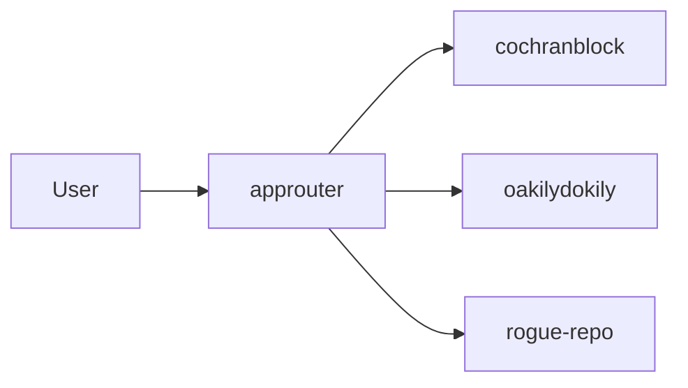

<!-- Unlicense — cochranblock.org -->
<!-- Contributors: Mattbusel (XFactor), GotEmCoach, KOVA, Claude Opus 4.6, SuperNinja, Composer 1.5, Google Gemini Pro 3 -->

> **It's not the Mech — it's the pilot.**
>
> This repo is part of [CochranBlock](https://cochranblock.org) — 8 Unlicense Rust repositories that power an entire company on a **single <10MB binary**, a laptop, and a **$10/month** Cloudflare tunnel. No AWS. No Kubernetes. No six-figure DevOps team. Zero cloud.
>
> **[cochranblock.org](https://cochranblock.org)** is a live demo of this architecture. You're welcome to read every line of source code — it's all public domain.
>
> Every repo ships with **[Proof of Artifacts](PROOF_OF_ARTIFACTS.md)** (wire diagrams, screenshots, and build output proving the work is real) and a **[Timeline of Invention](TIMELINE_OF_INVENTION.md)** (dated commit-level record of what was built, when, and why — proving human-piloted AI development, not generated spaghetti).
>
> **Looking to cut your server bill by 90%?** → [Zero-Cloud Tech Intake Form](https://cochranblock.org/deploy)

---

<p align="center">
  
</p>

# approuter

Index and router for cochranblock products.

## Proof of Artifacts

*Wire diagrams for quick review.*

### Wire / Architecture



---

**This repo contains approuter only.** Product source lives in separate repos.

## Products (separate repos)

| Product | Repo | Description |
|---------|------|-------------|
| **cochranblock** | [cochranblock/cochranblock](https://github.com/cochranblock/cochranblock) | cochranblock.org site |
| **oakilydokily** | [cochranblock/oakilydokily](https://github.com/cochranblock/oakilydokily) | Hero site with mural |
| **rogue-repo** | [cochranblock/rogue-repo](https://github.com/cochranblock/rogue-repo) | Software repo + ISO 8583 |
| **kova** | [cochranblock/kova](https://github.com/cochranblock/kova) | Augment engine |
| **whyyoulying** | [cochranblock/whyyoulying](https://github.com/cochranblock/whyyoulying) | Labor fraud detection |
| **wowasticker** | [cochranblock/wowasticker](https://github.com/cochranblock/wowasticker) | Student goals app |

## This repo

- **approuter** — Reverse proxy + app registration for Cloudflare tunnel. Routes traffic to the products above.

## Build

```bash
cargo build -p approuter
```

## Local development

Clone the product repos alongside this one. Run approuter; it will route to backends by URL (e.g. `ROUTER_COCHRANBLOCK_URL`, `ROUTER_OAKILYDOKILY_HOST`).