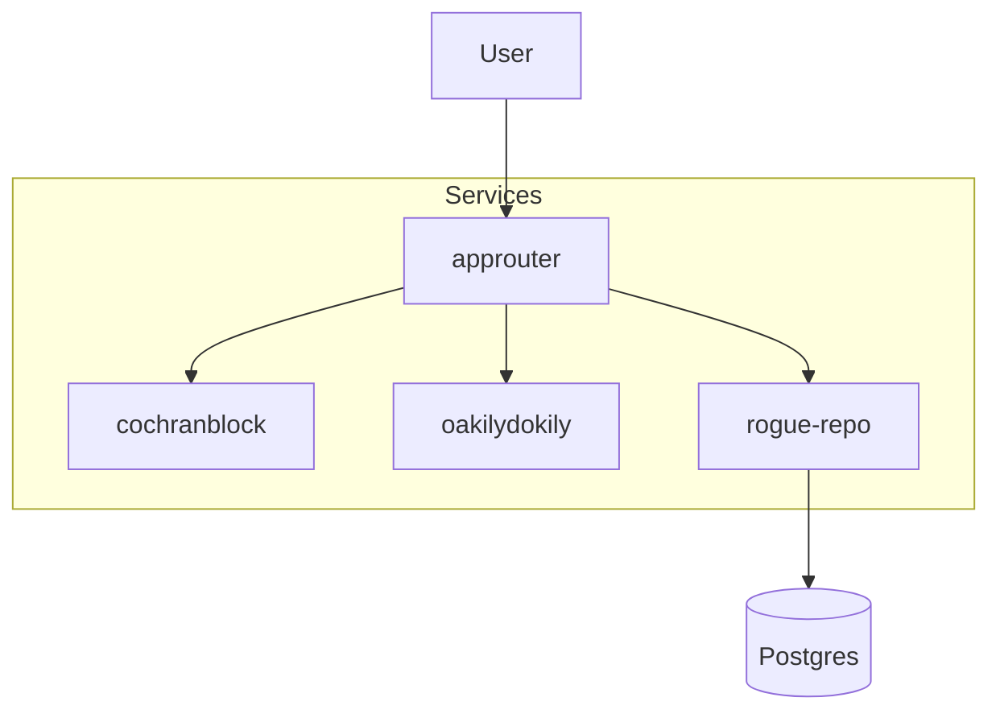

# cochranblock-stack

Monorepo for Railway deployment: approuter, cochranblock, oakilydokily, rogue-repo.

## Proof of Artifacts

*Wire diagrams, screenshots, and demos for quick review.*

### Wire / Architecture



## Build from workspace

```bash
./scripts/build-monorepo.sh /path/to/workspace/root
```

## Railway setup

1. Create project at [railway.com](https://railway.com)
2. Add 4 services + Postgres
3. Connect this repo (or push to cochranblock/cochranblock-stack)
4. Set Root Directory per service: approuter, cochranblock, oakilydokily, rogue-repo
5. Add env vars per [approuter/docs/RAILWAY.md](approuter/docs/RAILWAY.md)

## GitHub

Push to cochranblock/cochranblock-stack (create repo first if needed).
