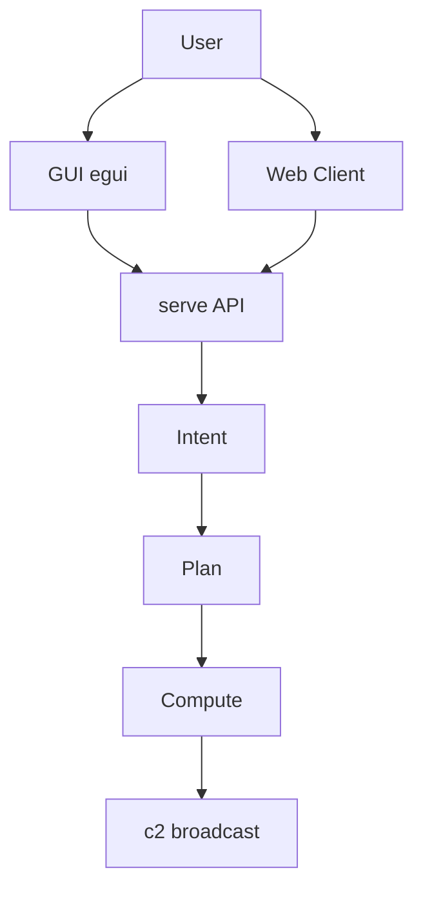

# Kova

## Proof of Artifacts

*Wire diagrams, screenshots, and demos for quick review.*

### Wire / Architecture



### Screenshots

| View | Description |
|------|-------------|
|  | GUI window |
|  | Web client |

### Demo

*Add `docs/artifacts/demo-gui.gif` for GUI or web flow.*

---

Augment engine. Hybrid: native egui GUI + web client, shared API. Tokenized orchestration (f18–f23), c2 broadcast, hive sync.

## Build

```bash
cargo build -p kova --features serve
cargo run -p kova
```

## Docs

- [docs/HIVE_BLAZING.md](docs/HIVE_BLAZING.md) — Parallel sync + broadcast
- [docs/compression_map.md](docs/compression_map.md) — Tokenization
