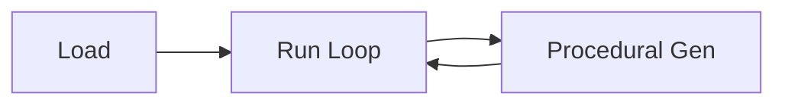

<!-- Copyright (c) 2026 The Cochran Block. All rights reserved. -->
# Rogue Runner

1000-level endless runner. Procedural generation, offline, cross-platform.

## Proof of Artifacts

*Wire diagrams, screenshots, and demos for quick review.*

### Wire / Architecture



### Screenshots

| View | Description |
|------|-------------|
|  | In-game screenshot |

### Demo

*Add `docs/artifacts/demo-gameplay.gif` for 10–15s gameplay; optional `demo-gameplay.mp4` for longer.*

## Targets

| Platform | Build | Notes |
|----------|-------|-------|
| **Web** | `./scripts/build-web.sh` | wasm32. Serves at `/apps/rogue-runner-wasm` |
| **Windows** | `./scripts/build-windows.sh` | x86_64-pc-windows-gnu. Needs mingw-w64 on Linux |
| **iOS Simulator** | `./scripts/build-ios-sim.sh` | macOS only. x86_64-apple-ios |
| **Android** | `./scripts/build-android.sh` | Docker + cargo-quad-apk |

## Web

```sh
./scripts/build-web.sh
# Wasm copied to rogue-repo assets. Run rogue-repo, open /apps/rogue-runner-wasm
```

## Native (host)

```sh
cargo run -p rogue-runner
```
