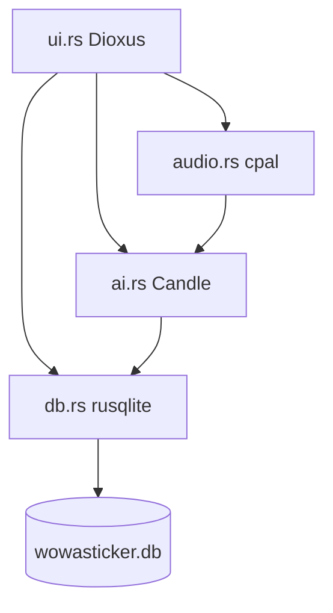

# wowasticker

Pure Rust, offline-first mobile app for student behavioral goals. Local AI dictation via Candle Whisper, SQLite persistence, thumb-zone optimized UI.

## Proof of Artifacts

*Wire diagrams, screenshots, and demos for quick review.*

### Wire / Architecture (Mermaid)



### Wire / Architecture (ASCII)

```
                    ┌─────────────────────────────────────────┐
                    │              ui.rs (Dioxus)              │
                    │  thumb-zone, ScheduleCard, Dictate btn   │
                    └───────────────┬─────────────────────────┘
                                    │
         ┌──────────────────────────┼──────────────────────────┐
         │                          │                          │
         ▼                          ▼                          ▼
┌─────────────────┐    ┌─────────────────────┐    ┌─────────────────────┐
│     db.rs       │    │     audio.rs        │    │      ai.rs          │
│    (rusqlite)   │    │      (cpal)         │    │    (candle)         │
│                 │    │                     │    │                     │
│ • blocks        │    │ mic ──► 10s buffer  │    │ samples ──► Whisper │
│ • stickers      │◄───│        │            │    │   (GGUF)    │       │
│ • students      │    │        ▼            │    │        │            │
│                 │    │  resample 16kHz     │───►│        ▼            │
│ get/set_sticker │    │        │            │    │  parse 0/1/2        │
└────────┬────────┘    └─────────────────────┘    └──────────┬──────────┘
         │                                                      │
         │  ◄───────────────────────────────────────────────────┘
         │              sticker value
         ▼
┌─────────────────┐
│  wowasticker.db │
│  (on-device)    │
└─────────────────┘

Wire flow: User tap ─► audio capture ─► transcribe ─► parse ─► db write ─► UI refresh
```

### Screenshots

| View | Description |
|------|-------------|
|  | ScheduleCard UI |
|  | Dictation flow |

### Demo

*Add `docs/artifacts/demo-dictation.gif` for tap → dictate → sticker update.*

## Build

**Desktop (Linux):** Install GTK/WebKit deps, then:

```bash
# With audio (requires libalsa)
cargo build -p wowasticker --features audio

# Without audio (UI + DB only)
cargo build -p wowasticker
```

**Linux deps (Ubuntu/Debian):**
```bash
sudo apt install libgtk-3-dev libwebkit2gtk-4.1-dev libasound2-dev
```

**Mobile (iOS/Android):** Use `dioxus mobile init` and target mobile. See [Dioxus Mobile](https://dioxuslabs.com/learn/0.5/getting_started/mobile).

## Modules

| Module | Purpose |
|--------|---------|
| `db` | SQLite: students, schedule_blocks, sticker_records (with note). `set_sticker_today_with_note()` stores dictation text |
| `audio` | cpal capture, 10s buffer, resample to 16kHz. Feature-gated (`--features audio`) |
| `ai` | `transcribe_audio()` Candle Whisper GGUF; `extract_behavior()` → score + note + tags; `parse_sticker_from_transcription()` heuristics |
| `ui` | Dioxus App, ScheduleCard, dictation button, async flow |

## Data Flow

1. User taps schedule block → selects it
2. User taps "Dictate Observation" → `capture_audio()` (10s) → `transcribe_audio()` → `extract_behavior()` → `db.set_sticker_today_with_note()`
3. UI refreshes via `refresh` signal

## Model

```bash
# Download Whisper-Tiny GGUF (Candle-compatible)
./scripts/download-whisper.sh

# Set path (optional; default: whisper-tiny.gguf in cwd)
export WOWASTICKER_WHISPER_PATH=/path/to/whisper-tiny-q4_k.gguf
```

Candle 0.8 loads GGUF; full decode pipeline (mel→encoder→decoder→tokenizer) is scaffolded. Heuristic `extract_behavior()` runs regardless.
